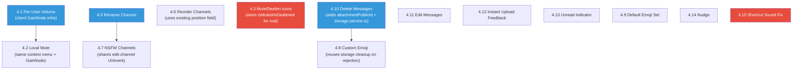

# Reson8 — Next Steps PRD (Phase 9)

**Created:** 11/08/2026
**Author:** Felipe B. Netto (assisted by AI)
**Status:** Draft — Pending Review
**Source:** `app-planning/nextsteps.txt`

---

## Table of Contents

1. [PRD 4.1 — Per-User Volume Levels](#prd-41--per-user-volume-levels)
2. [PRD 4.2 — Mute a Single User (Local)](#prd-42--mute-a-single-user-local)
3. [PRD 4.3 — Self-Mute / Self-Deafen Status Icons](#prd-43--self-mute--self-deafen-status-icons)
4. [PRD 4.4 — Session Timer Visibility](#prd-44--session-timer-visibility)
5. [PRD 4.5 — Channel Post-Creation Editing (Rename)](#prd-45--channel-post-creation-editing-rename)
6. [PRD 4.6 — Channel Reordering (Drag & Drop)](#prd-46--channel-reordering-drag--drop)
7. [PRD 4.7 — NSFW Text Channels](#prd-47--nsfw-text-channels)
8. [PRD 4.8 — Custom Emoji Upload](#prd-48--custom-emoji-upload)
9. [PRD 4.9 — Default Emoji Set Completion](#prd-49--default-emoji-set-completion)
10. [PRD 4.10 — Delete Own Messages](#prd-410--delete-own-messages)
11. [PRD 4.11 — Edit Own Messages (2-Minute Window)](#prd-411--edit-own-messages-2-minute-window)
12. [PRD 4.12 — Instant Image Upload Feedback](#prd-412--instant-image-upload-feedback)
13. [PRD 4.13 — Unread Text Channel Indicator](#prd-413--unread-text-channel-indicator)
14. [PRD 4.14 — Nudge](#prd-414--nudge)
15. [PRD 4.15 — Fix Shortcut Sound Alerts (Mute/Deafen/Disconnect)](#prd-415--fix-shortcut-sound-alerts-mutedeafendisconnect)
16. [Cross-Cutting Dependencies & Implementation Order](#cross-cutting-dependencies--implementation-order)

> [!IMPORTANT]
> Every implementation must be tracked and logged into `app-planning/progress.txt`
> using the `/log-progress` slash command immediately after the item is completed
> and verified, following the established `--- Entry: DD/MM/YYYY ---` format. This
> is not optional cleanup — treat it as part of finishing each PRD item, exactly as
> it was for every prior phase (see `app-planning/progress.txt` and
> `app-planning/archive/progress-phases-1-8.txt`).

> [!NOTE]
> This PRD was written after auditing the current codebase (schema, socket-event
> map, and relevant handlers/renderer code) rather than assuming a clean slate.
> Two things worth flagging up front because several items below build on them:
> - `Channel.position Int @default(0)` **already exists** in the schema
>   (`apps/server/prisma/schema.prisma`) — PRD 4.6 reuses it rather than adding a
>   new column.
> - `IUserPresence` (`packages/shared-types/src/models.ts`) **already has**
>   `isMuted`/`isDeafened`/`isAway` fields, but they are hardcoded to `false`
>   everywhere they're constructed server-side
>   (`connection.handler.ts`, `moderation.handler.ts`) — mute/deafen today is a
>   purely client-local concept (`voiceService.toggleMute()`/`toggleDeafen()`
>   never emit a socket event). PRD 4.3 wires this up for real.

---

## PRD 4.1 — Per-User Volume Levels

**Type:** ✨ FEATURE
**Priority:** Medium
**Affected Components:** Client only (`voice.service.ts`, `renderer.ts`,
`preload.ts`) — no server/schema changes.

### Overview

While in a voice channel, a user can set a custom playback volume (0–200%,
100% = default) for any other participant. This is **purely client-local** —
it changes only what you hear; it has no effect on what anyone else hears and
is never sent to the server.

### Design Decisions

- Volume range: **0–200%**, default **100%**, matching the common convention
  used by Discord/TeamSpeak clients (so users can boost quiet talkers, not
  just attenuate loud ones).
- Persisted in `localStorage`, keyed by the **target's instance ID**
  (`reson8-local-volume-<userId>`), so a preference set for a given person
  survives app restarts and applies the next time you're in a channel with
  them (independent of which server/channel that happens on — the identity
  key is the user, per the existing instance-ID identity model).
- Applies per remote participant regardless of channel — it is not scoped to
  a single voice session.

### Why This Requires New Client-Side Plumbing

Per the codebase audit, `voice.service.ts` keys `consumers`/`audioElements`
maps by **`consumer.id`**, and has **no `userId` awareness at all** — the
`userId ↔ producerId` association lives one layer up in `preload.ts`
(`NEW_PRODUCER`/`EXISTING_PRODUCERS` payloads), which currently discards
`userId` after triggering consumption. Also, remote audio volume today is set
via the native `HTMLMediaElement.volume` property (0–1 range, hardcoded to
`1.0`), with **no Web Audio graph on the playback side at all** (the existing
`AnalyserNode`/`AudioContext` usage is only for local mic noise-gate
metering).

To go **above** 100% (per the 0–200% range decision), `HTMLMediaElement.volume`
is insufficient since it caps at 1.0 — a `GainNode` is required for boost.

### Implementation

1. **`preload.ts`**: retain the `userId` when wiring `NEW_PRODUCER` /
   `EXISTING_PRODUCERS` and pass it through to
   `voiceService.consumeProducer(producerId, userId)`.
2. **`voice.service.ts`**:
   - Add a `producerId → userId` map (or extend the existing consumer
     bookkeeping) so `audioElements` can be looked up by `userId`.
   - On consumer creation, build a small Web Audio graph per remote
     participant: `MediaElementSourceNode → GainNode → AudioContext.destination`,
     reusing the existing local `AudioContext` pattern already in the file.
     `gainNode.gain.value = targetVolumePercent / 100`.
   - Add `setLocalUserVolume(userId: string, percent: number): void`
     (0–200, clamped) and `getLocalUserVolume(userId: string): number`.
   - On `removeConsumer`, tear down that participant's Gain/Source nodes
     along with the existing audio-element cleanup.
3. **`preload.ts`**: expose `setLocalUserVolume`/`getLocalUserVolume` on
   `reson8Api`.
4. **`renderer.ts`**: on app load, hydrate a `Map<userId, percent>` from
   `localStorage`; apply saved volume to a participant's audio graph as soon
   as they're consumed (i.e., call `setLocalUserVolume` right after a new
   consumer is set up, not only when the user manually adjusts the slider).
   Volume control UI lives in the right-click context menu — see PRD 4.2,
   which extends the same menu.

### Files to Modify

| File | Change |
|:---|:---|
| `apps/client/src/preload.ts` | Thread `userId` through producer-consumption calls; expose `setLocalUserVolume`/`getLocalUserVolume` |
| `apps/client/src/services/voice.service.ts` | Add per-participant `GainNode` graph, `producerId→userId` map, volume get/set methods |
| `apps/client/src/renderer/renderer.ts` | `localStorage` hydration/persistence, wire volume slider (built in PRD 4.2's context menu) to `setLocalUserVolume` |

### Verification

1. Join a voice channel with two other clients (A, B).
2. Set A's local volume to 50% — only your client should get quieter audio
   from A; B's client (and A's own mic monitoring) is unaffected.
3. Set B's local volume to 150% — B should sound louder only to you.
4. Restart the app, rejoin the same channel — A/B's saved volumes should
   still apply without re-adjusting.
5. Confirm no socket event fires when adjusting volume (inspect server logs
   or add a temporary breakpoint) — this must stay 100% client-local.

---

## PRD 4.2 — Mute a Single User (Local)

**Type:** ✨ FEATURE
**Priority:** Medium
**Affected Components:** Client only (`renderer.ts`, `voice.service.ts`) —
no server/schema changes. Shares infrastructure with PRD 4.1.

### Overview

Right-clicking a voice channel participant's name opens a context menu with
a "Mute locally" toggle (in addition to the volume control from PRD 4.1).
Like volume, this is purely client-local: muting someone only silences them
for you.

### Design Decisions

- Lives in the **same** right-click context menu as the volume slider (one
  menu, two controls) — avoids two different interaction patterns for two
  closely related local-only settings.
- Local mute is implemented as `gainNode.gain.value = 0` while preserving
  the user's saved volume percentage underneath (so unmuting restores their
  configured volume, not a reset to 100%).
- Persisted the same way as volume: `localStorage`, keyed by target userId
  (`reson8-local-mute-<userId>`).

### Extending the Existing Context Menu

The codebase audit found a **custom DOM context menu already exists**, but
it's admin-only and single-purpose: `renderOccupants()` in `renderer.ts`
(occupant `contextmenu` listener) currently gates entirely on
`isAdminUser` and only offers "🚫 Kick from Channel". This needs to become a
general-purpose menu:

- Relax the gate: **everyone** gets the menu (for volume/local-mute); the
  "Kick from Channel" entry stays conditionally rendered only for admins
  (and never for the menu opened on yourself).
- Add to the menu: a volume slider (0–200%, PRD 4.1) and a "Mute locally" /
  "Unmute locally" toggle entry, showing current state.
- Menu positioning/dismissal logic (position at `e.clientX/clientY`, close on
  outside click) is already correct and reusable as-is.

### Files to Modify

| File | Change |
|:---|:---|
| `apps/client/src/renderer/renderer.ts` | Generalize the occupant context menu (remove admin-only gate, add volume slider + local-mute toggle, keep Kick admin-gated) |
| `apps/client/src/services/voice.service.ts` | `setLocalUserMute(userId, muted)` — zeroes/restores the participant's `GainNode` |

### Verification

1. Right-click a non-admin user in a voice channel as a regular member —
   menu should now appear (previously nothing happened for non-admins).
2. Toggle "Mute locally" on participant A — you stop hearing A; A's own
   client and other participants are unaffected (verify with a 3rd client).
3. Un-mute — A's previously-set local volume (not 100%) is restored.
4. As an admin, right-click another user — both the new controls AND "Kick
   from Channel" should appear; right-clicking yourself shows neither.
5. Restart app, rejoin — local mute state for that user persists.

---

## PRD 4.3 — Self-Mute / Self-Deafen Status Icons

**Type:** ✨ FEATURE
**Priority:** Medium
**Affected Components:** Server (`voice.handler.ts` or new handler,
`presence.service.ts`), Client (`voice.service.ts`, `preload.ts`,
`renderer.ts`), `packages/shared-types`.

### Overview

When a user mutes their mic or deafens themselves, other voice channel
participants currently have no way to know — it looks like the person is
ignoring them. Add a small red SVG icon next to a participant's name in the
occupant list (channel tree) whenever they are muted and/or deafened.

### Why This Is Currently Impossible

As flagged in the top-of-document note: `IUserPresence.isMuted`/`isDeafened`
already exist in the shared type and in every occupant object built
server-side, but are **hardcoded to `false`** wherever occupants are
constructed (`connection.handler.ts` lines 201-202, 287-288, 324-325,
401-402, 451-452; `moderation.handler.ts` 96-97). Meanwhile,
`voiceService.toggleMute()`/`toggleDeafen()` (`preload.ts` lines 290-295)
are pure client-local calls into `voice.service.ts` — **no socket event is
ever emitted**. The server has no idea a client muted itself, so it cannot
broadcast the true state, and the fields exist but always lie.

### Design Decisions

- Icon color: **red**, per the roadmap spec. Two distinct icons (mic-muted,
  headphones-deafened) shown side by side when both apply.
- Deafening implies muted (already true in the existing client toggle logic
  per Phase 2/8 history) — the deafen icon should be sufficient on its own
  when deafened; still send both flags for correctness/future flexibility.

### Implementation

1. **`packages/shared-types/src/socket-events.ts`**: add a new client→server
   event, e.g.:
   ```ts
   SET_VOICE_STATE: (
     payload: { isMuted: boolean; isDeafened: boolean },
     ack: (res: { success: boolean }) => void
   ) => void;
   ```
2. **Server** (new handler function, likely in `voice.handler.ts`): on
   `SET_VOICE_STATE`, update the user's Redis presence record
   (`presence.service.ts`) with the real `isMuted`/`isDeafened`, then
   re-broadcast `PRESENCE_UPDATE` for that channel — mirroring how other
   presence-affecting actions already refresh and broadcast occupants.
3. **Client** (`preload.ts`): after `voiceService.toggleMute()` /
   `toggleDeafen()` resolve locally, emit `SET_VOICE_STATE` with the new
   combined state so other clients find out.
4. **Client** (`renderer.ts`): in the occupant-list rendering code, if
   `occ.isMuted` render a red mic-muted SVG; if `occ.isDeafened` render a red
   headphones-muted SVG (both inline SVG, ~12–14px, matching the existing
   speaking-indicator dot's sizing conventions).
5. On reconnect, ensure the freshly (re)hydrated presence reflects last-known
   mute/deafen state — client should re-emit `SET_VOICE_STATE` after
   reconnecting to a channel if it was muted/deafened before the drop
   (otherwise the icon incorrectly clears itself).

### Files to Modify

| File | Change |
|:---|:---|
| `packages/shared-types/src/socket-events.ts` | Add `SET_VOICE_STATE` client→server event |
| `apps/server/src/handlers/voice.handler.ts` | Handle `SET_VOICE_STATE`: update presence, broadcast `PRESENCE_UPDATE` |
| `apps/server/src/services/presence.service.ts` | Support updating `isMuted`/`isDeafened` on an existing presence record |
| `apps/client/src/preload.ts` | Emit `SET_VOICE_STATE` after local mute/deafen toggles (and on reconnect if previously muted/deafened) |
| `apps/client/src/renderer/renderer.ts` | Render red mute/deafen SVG icons next to occupant names based on `occ.isMuted`/`occ.isDeafened` |

### Verification

1. Two clients (A, B) in a voice channel. A mutes — B's channel tree shows a
   red mic-muted icon next to A's name; A's own view does not need the icon
   (or may show it too — either is acceptable, but must appear for others).
2. A deafens — red deafen icon appears for B; A unmutes/undeafens — icons
   clear for B.
3. A disconnects and reconnects while muted — B should immediately see the
   mute icon again after A rejoins (no stale "unmuted" flash).
4. Confirm `PRESENCE_UPDATE` payloads inspected via logging show real
   `isMuted`/`isDeafened` values, not hardcoded `false`.

---

## PRD 4.4 — Session Timer Visibility

**Type:** 🐛 BUGFIX / UI polish
**Priority:** Low
**Affected Components:** Client (`index.html` CSS only).

### Overview

The voice channel session timer (added in Phase 8, PRD 3.5) currently
renders as low-contrast gray text (`.session-timer { color: var(--text-muted);
opacity: 0.7; }`) on a dark background, making it hard to read. This is a
pure CSS/contrast fix — no logic changes.

### Implementation

- Increase contrast: use a brighter, still-secondary color token (e.g. a
  lighter gray or a subtle accent tint) and drop or reduce the `opacity: 0.7`
  dampening currently stacked on top of the muted color.
- Verify contrast against WCAG AA for small text (4.5:1) against the actual
  panel background color in use, in both the channel-tree context and the
  voice-panel context (two separate places the timer renders, per PRD 3.5).
- No change to timer logic, update interval, or format — this is styling
  only.

### Files to Modify

| File | Change |
|:---|:---|
| `apps/client/src/renderer/index.html` | Adjust `.session-timer` CSS (color/opacity) for readability |

### Verification

1. Join a voice channel, observe the timer in the channel tree and in the
   voice panel — text should be clearly legible at a glance against the dark
   theme.
2. Spot-check contrast ratio (e.g. via browser devtools color picker) meets
   AA for small text.

---

## PRD 4.5 — Channel Post-Creation Editing (Rename)

**Type:** ✨ FEATURE
**Priority:** Medium
**Affected Components:** Server (`channel.handler.ts`, shared-types),
Client (`renderer.ts`, `index.html`).

### Overview

Admins can currently create and delete channels but never rename an existing
one. Add a rename action, gated by the same `MANAGE_CHANNELS` permission
already used for channel CRUD.

### Design Decisions

- Scope: **name only**, per the roadmap wording ("can't change its name").
  Type (TEXT/VOICE), parent, and maxUsers are out of scope for this item.
- Reuses the existing `MANAGE_CHANNELS` permission bit — no new permission
  needed.

### Implementation

1. **`packages/shared-types/src/socket-events.ts`**: add
   ```ts
   RENAME_CHANNEL: (
     payload: { channelId: string; name: string },
     ack: (res: { success: boolean; error?: string }) => void
   ) => void;
   ```
2. **`apps/server/src/handlers/channel.handler.ts`**: new handler gated with
   `requirePermission(PermissionFlags.MANAGE_CHANNELS)`, validates
   non-empty/length-bounded name (mirror whatever validation
   `CREATE_CHANNEL` already applies), `prisma.channel.update()`, then
   broadcast a channel-tree-affecting update. Reuse the existing
   `CHANNEL_CREATED`-style broadcast pattern — likely simplest to just emit
   a fresh `CHANNEL_TREE_UPDATE` (already used for structural changes) rather
   than inventing a new `CHANNEL_RENAMED` event, for consistency with how
   the tree is otherwise kept in sync.
3. **Client**: add a "Rename" option to the existing channel-tree
   right-click/edit affordance (`renderChannel()` already has a delete
   context action per the codebase audit — add rename alongside it, admin
   gated) opening a small inline input or a reuse of the existing
   create-channel modal pattern pre-filled with the current name.

### Files to Modify

| File | Change |
|:---|:---|
| `packages/shared-types/src/socket-events.ts` | Add `RENAME_CHANNEL` event |
| `apps/server/src/handlers/channel.handler.ts` | Add rename handler, `MANAGE_CHANNELS`-gated |
| `apps/client/src/renderer/renderer.ts` | Add rename UI entry point + modal/inline-edit, call `api.renameChannel()` |
| `apps/client/src/preload.ts` | Expose `renameChannel(channelId, name)` |

### Verification

1. As admin, rename a text channel — name updates immediately for all
   connected clients (channel tree re-renders).
2. As a non-admin (no `MANAGE_CHANNELS`), confirm the rename option is not
   available / the server rejects a direct attempt with a permission error.
3. Rename a channel currently open in a chat tab — verify the tab header
   updates to the new name without requiring a reconnect.
4. Attempt an empty/invalid name — rejected client-side and/or server-side
   with a clear error, matching existing channel-name validation rules.

---

## PRD 4.6 — Channel Reordering (Drag & Drop)

**Type:** ✨ FEATURE
**Priority:** Medium-High (flagged in nextsteps.txt as a bigger change)
**Affected Components:** Server (`channel.handler.ts`, `channel-tree.service.ts`,
shared-types), Client (`renderer.ts`, `index.html`).

### Overview

Channels currently render in creation order with no way to reorder them
short of delete-and-recreate. Admins should be able to drag-and-drop reorder
channels.

### Design Decisions

- **Scope: siblings-only reordering** — dragging changes order among
  channels sharing the same `parentId`; dragging a channel into a
  *different* parent group is explicitly out of scope for this item (kept
  as a smaller, safer change; could be a follow-up PRD).
- Reuses the **existing** `Channel.position Int @default(0)` column — no
  migration needed for the data model itself, since this field already
  exists but the codebase audit found no UI/API currently mutates it beyond
  the default value.
- Gated by the existing `MANAGE_CHANNELS` permission.

### Implementation

1. **`packages/shared-types/src/socket-events.ts`**: add
   ```ts
   REORDER_CHANNELS: (
     payload: { parentId: string | null; orderedChannelIds: string[] },
     ack: (res: { success: boolean; error?: string }) => void
   ) => void;
   ```
   Sending the full ordered sibling list (rather than a single
   move-before/after delta) keeps the server logic simple (one transaction
   reassigns `position = index` for each ID) and avoids drift if two admins
   reorder concurrently — last write wins on the whole sibling set, which
   is an acceptable trade-off for an admin-only, low-concurrency action.
2. **Server**: validate all `orderedChannelIds` actually belong to
   `parentId` (and to the correct server) before applying, then
   `prisma.$transaction` a batch of `channel.update({ position })` calls,
   then broadcast `CHANNEL_TREE_UPDATE`.
3. **`channel-tree.service.ts`**: confirm/ensure the flat→nested builder
   already sorts siblings by `position` (if it currently sorts by
   `createdAt`, that's the actual root cause of the "2 before 1" bug
   described in nextsteps.txt, and needs to change to sort by `position`
   regardless of this feature).
4. **Client**: implement drag-and-drop on channel-tree nodes using the
   HTML5 Drag and Drop API (`draggable="true"`, `dragstart`/`dragover`/`drop`
   handlers) scoped to admins only; on drop, compute the new sibling order
   client-side and call `api.reorderChannels(parentId, orderedIds)`
   optimistically, reconciling with the server's `CHANNEL_TREE_UPDATE` echo.
   Non-admins see no drag affordance (channels remain static for them).

### Files to Modify

| File | Change |
|:---|:---|
| `packages/shared-types/src/socket-events.ts` | Add `REORDER_CHANNELS` event |
| `apps/server/src/handlers/channel.handler.ts` | Add reorder handler, `MANAGE_CHANNELS`-gated, transactional position update |
| `apps/server/src/services/channel-tree.service.ts` | Ensure sibling sort key is `position`, not `createdAt` |
| `apps/client/src/renderer/renderer.ts` | Drag-and-drop handlers on channel-tree nodes (admin-only), optimistic reorder + API call |
| `apps/client/src/preload.ts` | Expose `reorderChannels(parentId, orderedChannelIds)` |

### Verification

1. As admin, create channels "2" then "1" under the same parent — confirm
   current display order is creation order (reproducing the reported bug).
2. Drag "1" above "2" — order updates instantly and persists across a page
   reload / reconnect (position is server-persisted, not just local state).
3. Verify reordering is scoped to siblings — dragging within a subgroup does
   not affect channels under a different parent.
4. As non-admin, confirm no drag handles/affordance appear and a direct
   `REORDER_CHANNELS` emission is rejected server-side.
5. Reorder with two admin clients open simultaneously — final state should
   be consistent (no duplicate/missing positions) across both.

---

## PRD 4.7 — NSFW Text Channels

**Type:** ✨ FEATURE
**Priority:** Medium
**Affected Components:** Server (schema, `channel.handler.ts`,
shared-types), Client (`renderer.ts`, `index.html`).

### Overview

Admins can mark a text channel as NSFW (toggleable, same as the name — can
be unmarked). Any user attempting to open an NSFW-marked channel sees a
confirmation modal first; the channel only opens if they confirm.

### Design Decisions

- **Confirmation modal appears every time** the channel is opened (per
  explicit product decision) — not once-per-session or remembered. This
  matches the literal roadmap wording and keeps the warning meaningful.
- NSFW toggle uses the existing `MANAGE_CHANNELS` permission — same gate as
  rename (PRD 4.5); likely surfaced in the same edit UI/modal as the rename
  feature for a unified "edit channel" affordance rather than a separate
  control.
- Applies to **text channels only** (voice channels have no concept of
  "content" to warn about).

### Data Model Changes

```prisma
model Channel {
  // ...existing fields...
  isNsfw Boolean @default(false)
}
```
Requires a new migration (`npm run db:migrate` in `apps/server`).

### Implementation

1. **Schema**: add `isNsfw` to `Channel` (migration), add to `IChannel` in
   `packages/shared-types/src/models.ts`.
2. **Server**: extend `CREATE_CHANNEL` to accept an optional `isNsfw`
   (default `false`), and fold NSFW toggling into the rename/edit flow from
   PRD 4.5 (e.g. `RENAME_CHANNEL`'s payload could become a more general
   `UPDATE_CHANNEL { channelId, name?, isNsfw? }` — worth unifying with PRD
   4.5 during implementation rather than shipping two near-identical
   "admin edits a channel" events).
3. **Client**:
   - Channel creation modal: add an "NSFW" checkbox (text channels only).
   - Channel edit UI (from PRD 4.5): add the same checkbox, toggleable.
   - Channel tree: render a small "NSFW" badge/tag next to NSFW channel
     names so users know before clicking.
   - On click-to-open an NSFW text channel: intercept the normal
     open-channel flow, show a confirm modal (reuse the existing custom
     modal pattern — `window.confirm()` is unusable in this Electron
     renderer per Phase 3 history) with clear warning copy and
     Cancel/Continue actions; only proceed to open the tab on Continue.

### Files to Modify

| File | Change |
|:---|:---|
| `apps/server/prisma/schema.prisma` | Add `Channel.isNsfw Boolean @default(false)` + migration |
| `packages/shared-types/src/models.ts` | Add `isNsfw: boolean` to `IChannel` |
| `packages/shared-types/src/socket-events.ts` | Extend `CREATE_CHANNEL` payload with optional `isNsfw`; extend/add channel-update event for toggling it |
| `apps/server/src/handlers/channel.handler.ts` | Persist `isNsfw` on create/update |
| `apps/client/src/renderer/renderer.ts` | NSFW checkbox in create/edit modals, NSFW badge in tree, confirmation modal intercepting channel-open |
| `apps/client/src/renderer/index.html` | NSFW badge styling, confirmation modal markup (if not reusing an existing generic modal) |

### Verification

1. As admin, create a text channel with NSFW checked — badge appears in the
   tree for all users.
2. As any user, click the NSFW channel — confirmation modal appears; Cancel
   leaves the channel unopened; Continue opens it normally.
3. Click the same channel again — modal appears **again** (not remembered).
4. As admin, unmark NSFW via edit — badge disappears, clicking now opens
   directly with no modal.
5. Non-NSFW channels are entirely unaffected (no modal, no badge).

---

## PRD 4.8 — Custom Emoji Upload

**Type:** ✨ FEATURE
**Priority:** Medium-High
**Affected Components:** Server (schema, new route/handler, shared-types),
Client (`renderer.ts`, `index.html`, `preload.ts`).

### Overview

Any user can upload a custom emoji image (max 500KB, unique name) which,
after being cropped client-side, becomes usable everywhere emoji are usable
across the server. New uploads enter an **admin approval queue** before
becoming available (per product decision) — admins review and
approve/reject in a new moderation surface.

### Design Decisions

- **Admin approval required** before an uploaded emoji becomes usable —
  chosen over instant availability to guard against abuse, since this is
  server-wide, persistent, user-generated content.
- New permission bit `MANAGE_EMOJIS` for the approve/reject action, keeping
  it separate from blanket `ADMIN` so it could later be delegated to a
  moderator role without granting full admin — consistent with this
  project's existing fine-grained permission philosophy.
- Server-scoped: an approved custom emoji is visible to **every** member of
  that server, uploader included, alongside the standard Unicode set.
- Crop tool output: fixed **128×128 PNG**, matching common chat-app emoji
  sizing (Discord uses 128×128 for custom emoji) — cropped/resized entirely
  client-side via `<canvas>` before upload, so the 500KB limit is checked
  against the *original* selected file (pre-crop), keeping the check simple
  and matching the roadmap's wording ("send a image type file with maximum
  of 500kb").
- Uniqueness: emoji `name` unique **per server** (not globally).

### Data Model Changes

```prisma
model CustomEmoji {
  id          String       @id @default(uuid())
  serverId    String
  server      Server       @relation(fields: [serverId], references: [id], onDelete: Cascade)
  name        String       // unique per server, e.g. "pepehands"
  imageUrl    String
  imagePublicId String?    // Cloudinary public_id, for future deletion support
  uploadedBy  String       // instance ID
  status      EmojiStatus  @default(PENDING)
  createdAt   DateTime     @default(now())
  reviewedAt  DateTime?
  reviewedBy  String?

  @@unique([serverId, name])
}

enum EmojiStatus {
  PENDING
  APPROVED
  REJECTED
}
```

### New Permission

`packages/shared-types/src/models.ts` — add to `PermissionFlags`:
```ts
MANAGE_EMOJIS = 1 << 9, // 512
```
(Next free bit after `ADMIN = 1 << 8`, per current audit.)

### Implementation

1. **Upload path**: reuse the existing `POST /api/upload` REST endpoint's
   storage plumbing (local disk / Cloudinary dual-backend), or add a
   sibling `POST /api/upload/emoji` with a tighter MIME/size check (500KB
   vs the existing 5MB general limit) — a dedicated route is cleaner than
   overloading the general uploader with emoji-specific size rules.
2. **Client crop tool**: on file select, open a modal with a `<canvas>`-based
   crop UI (drag to position/scale a fixed square crop region over the
   image), output a 128×128 PNG blob, then upload it + submit the chosen
   unique name via a new socket event:
   ```ts
   CREATE_CUSTOM_EMOJI: (
     payload: { name: string; imageUrl: string; imagePublicId?: string },
     ack: (res: { success: boolean; error?: string }) => void
   ) => void;
   ```
3. **Server**: validate name (alphanumeric/underscore, length bounds,
   uniqueness within the server), create `CustomEmoji` row with
   `status: PENDING`.
4. **Moderation queue** (admin-only, `MANAGE_EMOJIS`-gated):
   - `GET_PENDING_EMOJIS` → list pending emoji for review.
   - `REVIEW_CUSTOM_EMOJI: { emojiId, decision: "APPROVED" | "REJECTED" }`
     → updates status/`reviewedAt`/`reviewedBy`; on approval, broadcast
     `CUSTOM_EMOJI_APPROVED { serverId, emoji }` to the server room so all
     connected clients' pickers update live; on rejection, optionally
     delete the uploaded image from storage (mirrors the storage-cleanup
     need already identified in PRD 4.10).
   - Surfaced as a new tab/section in the existing admin Settings modal
     (alongside Roles) — a small badge/count for pending items is a
     reasonable addition but not required by the roadmap item itself.
5. **Emoji picker integration**: per the audit, `EMOJI_DATA` in
   `renderer.ts` is a static hardcoded array feeding
   `renderEmojiGrid()`/`buildEmojiCategoryTabs()`, with no existing plugin
   point for a non-static source. Add a **10th tab, "+"**, that renders
   approved `CustomEmoji` rows fetched via `GET_APPROVED_EMOJIS` on server
   join (and updated live via `CUSTOM_EMOJI_APPROVED`), each rendered as an
   `` (not a Unicode glyph) reusing the same grid layout; selecting one
   inserts a shortcode-style token (e.g. `:pepehands:`) into chat input or
   triggers `TOGGLE_REACTION` with that token as the "emoji" value — message
   rendering must then recognize `:name:` tokens matching approved custom
   emoji and render the `` inline instead of literal text. A "+" button
   inside that tab opens the upload modal described above.

### Files to Modify

| File | Change |
|:---|:---|
| `apps/server/prisma/schema.prisma` | Add `CustomEmoji` model + `EmojiStatus` enum + migration |
| `packages/shared-types/src/models.ts` | Add `MANAGE_EMOJIS` permission flag, `ICustomEmoji` DTO |
| `packages/shared-types/src/socket-events.ts` | Add `CREATE_CUSTOM_EMOJI`, `GET_PENDING_EMOJIS`, `GET_APPROVED_EMOJIS`, `REVIEW_CUSTOM_EMOJI`, `CUSTOM_EMOJI_APPROVED` |
| `apps/server/src/routes/upload.route.ts` (or new sibling route) | Emoji-specific upload path with 500KB limit |
| `apps/server/src/handlers/` | New `emoji.handler.ts` (or extend `reaction.handler.ts`) for the events above |
| `apps/client/src/renderer/renderer.ts` | Crop-tool modal, "+" picker tab, custom-emoji fetch/cache, `:name:` message-rendering support, admin moderation queue UI |
| `apps/client/src/renderer/index.html` | Crop modal markup/CSS, "+" tab styling, moderation queue UI in Settings |
| `apps/client/src/preload.ts` | Expose the new emoji API surface |

### Verification

1. Upload a 400KB PNG with a unique name — crop tool appears, produces a
   128×128 image, submission lands in the admin's pending queue (not yet
   usable in the picker for anyone, including the uploader).
2. Attempt a 600KB file — rejected client-side before upload.
3. Attempt a duplicate name within the same server — rejected with a clear
   error.
4. As admin, approve the pending emoji — it now appears in the "+" tab for
   all connected clients without a reload, and can be inserted into chat /
   used as a message reaction.
5. As admin, reject a different pending upload — it never appears in any
   picker; underlying image file is removed from storage.
6. As non-admin, confirm the moderation queue view/actions are not
   accessible.

---

## PRD 4.9 — Default Emoji Set Completion

**Type:** ✨ FEATURE / content gap-fill
**Priority:** Low
**Affected Components:** Client only (`renderer.ts` — `EMOJI_DATA` array).

### Overview

The picker's curated `EMOJI_DATA` array (~379 entries, `renderer.ts`) is
missing some emoji generally considered part of the "default" set common
across major chat platforms (Discord/Slack/iOS use broadly overlapping
defaults derived from the Unicode "fully-qualified" recommended set).

### Approach

This is a content audit, not an architecture change:

1. Diff the existing `EMOJI_DATA` names/categories against a standard
   reference (e.g. the Unicode CLDR "recommended for general interchange"
   emoji list, or an equivalent well-known dataset) to identify gaps —
   particularly likely to be missing: newer skin-tone-neutral additions,
   commonly-used symbols (e.g. ✅ ❌ ♥️ variants), and any category with
   noticeably fewer entries than its peers.
2. Add missing entries following the existing `EmojiEntry` shape
   (`{ emoji, name, keywords[], category }`), keeping them within the
   existing 9 fixed categories (no new categories needed, per the "+"
   custom-emoji tab from PRD 4.8 being the only addition to the tab count).
3. No dedupe risk beyond checking the existing array first, since
   `EMOJI_DATA` is the single source for both the picker grid and reaction
   search.

### Files to Modify

| File | Change |
|:---|:---|
| `apps/client/src/renderer/renderer.ts` | Append missing entries to `EMOJI_DATA` |

### Verification

1. Search the picker for a handful of commonly-expected emoji confirmed
   missing during the audit — they now appear with correct category
   placement and searchable keywords.
2. Spot-check no duplicate entries were introduced (same emoji character
   appearing twice).

---

## PRD 4.10 — Delete Own Messages

**Type:** ✨ FEATURE
**Priority:** Medium
**Affected Components:** Server (`message.handler.ts`, `dm.handler.ts`,
shared-types, upload/storage cleanup), Client (`renderer.ts`).

### Overview

Users can delete their own sent messages (text channel and DM), including
image attachments — the underlying image file is removed from storage, not
just unlinked from the message.

### Design Decisions

- **Hard delete** (per product decision): the message row is fully removed
  and disappears from the UI with no placeholder/tombstone — simpler than a
  soft-delete + rendering-placeholder approach, and matches what was chosen
  over the "[message deleted]" alternative.
- Applies to both channel `Message` rows and `DirectMessage` rows — the
  roadmap explicitly calls out "a text channel and a direct message chat."
- A user may delete only their **own** messages (no moderation-delete-others
  in this item; that would be a separate future moderation feature).

### Storage Cleanup Gap

The codebase audit found **no delete-from-storage code exists anywhere** —
no `fs.unlink`, no `cloudinary.uploader.destroy`, no DELETE route. Also,
`Message.attachmentUrl` alone isn't enough to delete a Cloudinary asset
(deletion needs the `public_id`, not just the delivered URL). This item
needs both new deletion logic **and** a schema addition to retain the
`public_id` at upload time.

### Data Model Changes

```prisma
model Message {
  // ...existing fields...
  attachmentPublicId String? // Cloudinary public_id, null for local-disk storage or text-only messages
}
model DirectMessage {
  // ...existing fields...
  attachmentPublicId String?
}
```
Requires updating `upload.route.ts` to return `publicId` alongside `url`
when using the Cloudinary backend, and both `SEND_MESSAGE`/DM-send handlers
to persist it.

### Implementation

1. **Schema**: add `attachmentPublicId` to both `Message` and
   `DirectMessage` (migration).
2. **`upload.route.ts`**: Cloudinary branch already receives `secure_url`
   from the upload response — also capture and return `public_id`
   (`{ url, publicId? }`).
3. **New shared helper** (server-side, e.g.
   `apps/server/src/services/storage.service.ts`): `deleteAttachment(url,
   publicId?)` — branches on whether `publicId` is present (Cloudinary
   `destroy`) vs a local-disk path derived from the stored URL (`fs.unlink`
   under the `./uploads/` root, with a path-traversal guard since the URL is
   client-adjacent data).
4. **New socket events**:
   ```ts
   DELETE_MESSAGE: (payload: { messageId: string }, ack) => void;
   DELETE_DIRECT_MESSAGE: (payload: { dmId: string }, ack) => void;
   ```
   Server verifies `message.userId === socket.data.userId` (own-message-only,
   no permission bypass even for admins in this item's scope), deletes any
   attachment via the new helper if `attachmentUrl` is set, deletes the row,
   and broadcasts `MESSAGE_DELETED { channelId, messageId }` /
   `DIRECT_MESSAGE_DELETED { dmId }` so all viewing clients remove it live.
5. **Client**: add a "Delete" option (own messages only) to the existing
   message hover/action affordance (wherever reactions are currently
   triggered from — likely a hover toolbar per the existing reaction UI),
   with a confirmation step (reuse the existing custom-modal pattern, not
   `window.confirm()`) given this is destructive and irreversible (hard
   delete). On `MESSAGE_DELETED`/`DIRECT_MESSAGE_DELETED`, remove the
   message element from the DOM for all open clients.

### Files to Modify

| File | Change |
|:---|:---|
| `apps/server/prisma/schema.prisma` | Add `attachmentPublicId` to `Message`/`DirectMessage` + migration |
| `apps/server/src/routes/upload.route.ts` | Return `publicId` for Cloudinary uploads |
| `apps/server/src/services/storage.service.ts` (new) | `deleteAttachment(url, publicId?)` helper (Cloudinary destroy / local unlink) |
| `packages/shared-types/src/socket-events.ts` | Add `DELETE_MESSAGE`, `DELETE_DIRECT_MESSAGE`, `MESSAGE_DELETED`, `DIRECT_MESSAGE_DELETED` |
| `apps/server/src/handlers/message.handler.ts` | Delete handler: ownership check, attachment cleanup, row delete, broadcast |
| `apps/server/src/handlers/dm.handler.ts` | Same for DMs |
| `apps/client/src/renderer/renderer.ts` | Delete action UI (own messages only), confirmation modal, live removal on broadcast |

### Verification

1. Send a text-only message, delete it — disappears for you and any other
   open client immediately; confirm the row no longer exists (e.g. via
   `FETCH_MESSAGES` no longer returning it after a fresh fetch/pagination).
2. Send an image message (local-disk backend), delete it — message
   disappears AND the file under `./uploads/` is actually removed from disk.
3. Repeat with Cloudinary configured — asset is removed from the Cloudinary
   account (verify via dashboard or API), not just DB-unlinked.
4. Attempt to delete someone else's message directly via a crafted
   `DELETE_MESSAGE` emission — rejected server-side.
5. Repeat all of the above for a DM conversation.

---

## PRD 4.11 — Edit Own Messages (2-Minute Window)

**Type:** ✨ FEATURE
**Priority:** Medium
**Affected Components:** Server (`message.handler.ts`, schema,
shared-types), Client (`renderer.ts`).

### Overview

For 2 minutes after sending, a user can edit the text content of their own
message (text messages only — not image attachments). Edited messages show
an "Edited" mark next to the timestamp.

### Design Decisions

- Text-only, matching the roadmap explicitly ("Only text messages... not
  sent images").
- Server-enforced 2-minute window, computed from `Message.createdAt` — the
  audit confirmed `createdAt` plus the existing `@@index([channelId,
  createdAt])` makes this a cheap check, and messages are purely DB-backed
  per request (no in-memory cache to invalidate).
- No edit-history versioning — the new content simply overwrites `content`,
  with `editedAt` set for the "Edited" mark. This keeps the feature small;
  full version history was not requested and isn't implied by the roadmap
  wording.
- Scope: **channel messages** — the roadmap item is listed under "Text
  Channels," not DMs; DM editing is not included here (open question for a
  future item if desired).

### Data Model Changes

```prisma
model Message {
  // ...existing fields...
  editedAt DateTime?
}
```

### Implementation

1. **Schema**: add `editedAt` to `Message` (migration).
2. **`packages/shared-types`**: add `editedAt?: string` to `IMessage`; new
   event:
   ```ts
   EDIT_MESSAGE: (
     payload: { messageId: string; content: string },
     ack: (res: { success: boolean; error?: string }) => void
   ) => void;
   ```
   Broadcast: `MESSAGE_EDITED: (payload: IMessage) => void;`
3. **Server**: verify `message.userId === socket.data.userId`, verify
   `message.attachmentUrl === null` (text-only), verify `Date.now() -
   message.createdAt.getTime() < 2 * 60 * 1000`, reject with a clear error
   otherwise (e.g. `"EDIT_WINDOW_EXPIRED"`), update `content` + `editedAt`,
   broadcast `MESSAGE_EDITED` to the server room.
4. **Client**: add an "Edit" action (own text-only messages, only while
   still within the window — client-side pre-check for UX, but the server
   check is authoritative) that swaps the message into an inline-editable
   state (reuse the chat input styling), Enter/blur to save, Escape to
   cancel. On `MESSAGE_EDITED`, update the rendered message content and show
   an "Edited" label next to its timestamp (tooltip could show the edit
   time, though not required by the roadmap).
   - Consider disabling/hiding the Edit action client-side once the 2-minute
     window visibly expires (e.g. a lightweight timer per visible message)
     so users aren't surprised by a server rejection after the fact.

### Files to Modify

| File | Change |
|:---|:---|
| `apps/server/prisma/schema.prisma` | Add `Message.editedAt DateTime?` + migration |
| `packages/shared-types/src/models.ts` | Add `editedAt?: string` to `IMessage` |
| `packages/shared-types/src/socket-events.ts` | Add `EDIT_MESSAGE`, `MESSAGE_EDITED` |
| `apps/server/src/handlers/message.handler.ts` | Edit handler: ownership + text-only + window checks, update, broadcast |
| `apps/client/src/renderer/renderer.ts` | Inline edit UI, "Edited" label rendering, client-side window-expiry UX |

### Verification

1. Send a text message, edit it within a few seconds — content updates for
   all clients, "Edited" label appears next to the timestamp.
2. Wait over 2 minutes, attempt to edit — server rejects; client should also
   have already hidden/disabled the affordance by then.
3. Attempt to edit an image message — no edit option offered (text-only
   restriction enforced both client and server side).
4. Attempt to edit someone else's message via a crafted emission — rejected
   server-side.
5. Confirm `FETCH_MESSAGES` returns `editedAt` for previously edited
   messages so the "Edited" mark survives a fresh channel load/scroll-back,
   not just the live session.

---

## PRD 4.12 — Instant Image Upload Feedback

**Type:** ✨ FEATURE / UX polish
**Priority:** Medium
**Affected Components:** Client only (`renderer.ts`) — no server/schema
changes (purely a client-side optimistic-UI pattern around the existing
upload flow).

### Overview

Today, selecting/pasting an image gives no feedback until the upload
finishes — users can't tell whether it actually went through. Add an
immediate local placeholder (with the image preview + an uploading
indicator) the instant the user initiates the send, replaced by the real
message once the upload completes.

### Implementation

1. On image select/paste, before calling the upload REST endpoint:
   - Generate a local preview via `URL.createObjectURL(file)`.
   - Render a placeholder message bubble immediately in the chat log (own
     message, right position/styling as if already sent) showing the local
     preview image with a semi-transparent overlay/spinner indicating
     "Uploading...".
2. Kick off the existing upload flow (`POST /api/upload`) in the background.
3. On success: replace the placeholder's image source with the real
   returned URL, remove the uploading overlay, and proceed with the normal
   `SEND_MESSAGE` call as it works today — swap the DOM node's identity from
   "local placeholder" to "real message" once the server ack/broadcast
   confirms persistence (or simply let the placeholder be replaced by the
   real `MESSAGE_RECEIVED` broadcast echo, deduplicating via a temporary
   client-generated ID so the placeholder doesn't double up with the
   server-confirmed message).
4. On failure: show an inline error state on the placeholder (e.g. red
   border + "Failed to send — retry?" with a retry action) rather than
   silently discarding it — this directly addresses the "user can't be sure
   if the image was properly sent" problem the roadmap describes, including
   for the failure case which is arguably the more important one to fix.
5. Revoke the `ObjectURL` once the real image is loaded/rendered to avoid a
   memory leak (`URL.revokeObjectURL`).

### Files to Modify

| File | Change |
|:---|:---|
| `apps/client/src/renderer/renderer.ts` | Optimistic placeholder rendering, upload-in-flight state, success/failure reconciliation, temporary-ID deduplication against the real broadcast message |
| `apps/client/src/renderer/index.html` | Uploading-overlay / spinner / failure-state CSS for the placeholder bubble |

### Verification

1. Send an image on a slow/throttled connection (devtools network
   throttling) — placeholder with local preview + spinner appears
   instantly, well before the upload completes.
2. Upload completes — placeholder seamlessly becomes the real message (no
   flicker/duplicate bubble).
3. Force an upload failure (e.g. temporarily point the upload URL at a bad
   endpoint, or exceed the size limit) — placeholder shows a clear failure
   state instead of silently vanishing or hanging forever.
4. Send two images back-to-back quickly — both get independent placeholders
   that resolve correctly to their respective real messages (no
   cross-mixing).

---

## PRD 4.13 — Unread Text Channel Indicator

**Type:** ✨ FEATURE
**Priority:** Medium-High
**Affected Components:** Server (schema, `channel.handler.ts` or
`connection.handler.ts`, shared-types), Client (`renderer.ts`).

### Overview

Text channels currently give no indication of unseen messages. Add a
visual cue (red dot + bolder channel name) on any text channel with
messages the user hasn't seen yet.

### Design Basis

The closest existing analog is DM unread tracking, which uses a `readAt`
flag **on each DM row** (`DirectMessage.readAt`) — that pattern doesn't
generalize to channels, since a channel is read by many different users at
different times (a per-row flag can't hold one "read" state per reader).
Instead this needs a **per-user-per-channel read cursor**, which doesn't
exist anywhere in the schema today.

The audit also confirmed `MESSAGE_RECEIVED` is broadcast to the **entire
server room** (`io.to(\`server:${serverId}\`)`), not scoped to clients who
currently have that channel's tab open — meaning every connected client
already receives every channel's messages in real time regardless of which
tab is active. This means the "is this new" determination can happen
**entirely client-side** (compare incoming `channelId` against the
currently active tab) without any new per-message server round trip; the
server only needs to persist a **cursor**, for restoring correct unread
state on reconnect/fresh load — exactly mirroring how DMs already solve the
same reconnect problem, just with a cursor instead of a per-row flag.

### Data Model Changes

```prisma
model ChannelRead {
  userId      String
  channelId   String
  channel     Channel  @relation(fields: [channelId], references: [id], onDelete: Cascade)
  lastReadAt  DateTime @default(now())

  @@id([userId, channelId])
}
```

### Implementation

1. **Schema**: add `ChannelRead` (migration).
2. **New socket event**:
   ```ts
   MARK_CHANNEL_READ: (payload: { channelId: string }, ack: (res: { success: boolean }) => void) => void;
   ```
   Server upserts `ChannelRead { userId, channelId, lastReadAt: now() }`.
3. **Initial unread state on join**: extend `IChannelTreeNode` with
   `hasUnread: boolean`, computed server-side during
   `hydrateOccupants()`/tree-build (`connection.handler.ts`,
   `channel-tree.service.ts`) by comparing each text channel's latest
   message `createdAt` against the user's `ChannelRead.lastReadAt` for that
   channel (no row = treat as unread only if the channel has ANY messages,
   to avoid flagging every empty channel as unread for new users) — this
   requires one extra query (latest message timestamp per channel, or a
   join) during tree hydration; keep it efficient by fetching latest-message
   timestamps in one batched query rather than N+1 per channel.
4. **Live updates client-side**: on `MESSAGE_RECEIVED`, if
   `payload.channelId` is not the currently active/open tab, mark that
   channel's tree node as unread (red dot + bold) locally — no server call
   needed for this direction.
5. **Clearing unread**: when a user opens/activates a text channel tab
   client-side, if it was flagged unread, clear the local flag immediately
   (UI responsiveness) and emit `MARK_CHANNEL_READ` in the background to
   persist the cursor.
6. **Rendering** (`renderer.ts`, channel-tree node rendering): a small red
   dot next to the channel name + bolder font-weight when `hasUnread` is
   true, matching the roadmap's suggested treatment; clear both the instant
   the channel is opened.

### Files to Modify

| File | Change |
|:---|:---|
| `apps/server/prisma/schema.prisma` | Add `ChannelRead` model + migration |
| `packages/shared-types/src/models.ts` | Add `hasUnread: boolean` to `IChannelTreeNode` |
| `packages/shared-types/src/socket-events.ts` | Add `MARK_CHANNEL_READ` |
| `apps/server/src/handlers/connection.handler.ts` | Compute `hasUnread` per text channel during tree hydration (batched latest-message-timestamp query) |
| `apps/server/src/handlers/channel.handler.ts` (or new) | Handle `MARK_CHANNEL_READ` upsert |
| `apps/client/src/renderer/renderer.ts` | Red-dot/bold rendering, live-update on `MESSAGE_RECEIVED` for inactive tabs, clear + `MARK_CHANNEL_READ` emission on channel open |

### Verification

1. Client A sends a message in text channel #general while Client B has a
   different channel open — B's tree shows the red dot + bold on #general
   immediately (no reload needed).
2. B opens #general — indicator clears immediately; reload/reconnect B —
   #general stays read (cursor persisted correctly).
3. New channel with no messages yet — never shows as unread for anyone.
4. B was offline when the message was sent; B reconnects — tree hydration
   correctly shows #general as unread (server-side computed from the
   persisted cursor vs. latest message timestamp, not just the live-update
   path).
5. Confirm the currently-active/open channel never flags itself unread even
   while receiving live messages in it.

---

## PRD 4.14 — Nudge

**Type:** ✨ NEW FEATURE
**Priority:** Medium
**Affected Components:** Server (schema, new handler, shared-types),
Client (`main.ts`, `renderer.ts`, `preload.ts`).

### Overview

Users can "nudge" another online user to get their attention. Server-wide
toggle (admin-controlled, default ON, unchangeable per-user by design).
30-second cooldown **per (sender, target) pair**. Only available for online
users, surfaced from the user list.

### Design Decisions

- **Cooldown: per (sender, target) pair** — nudging User A doesn't block
  nudging User B immediately after.
- **Receiving effect: sound alert + in-app toast/banner + taskbar/dock icon
  flash** (multi-select decision) — no window-shake animation. This keeps
  the effect noticeable (audio + visual + OS-level attention) without the
  extra `BrowserWindow` animation complexity a shake would require in
  `main.ts`.
- Server-wide toggle lives in a new "Server Settings" concept (doesn't
  currently exist as a distinct settings surface beyond Role management) —
  gated by `ADMIN` permission, since it's a whole-server behavioral switch,
  not a per-channel one.
- Only nudges users currently online (per Redis presence) — nudging an
  offline user is not offered as an action.

### Data Model Changes

```prisma
model Server {
  // ...existing fields...
  nudgeEnabled Boolean @default(true)
}
```

### Implementation

1. **Schema**: add `Server.nudgeEnabled` (migration). Note: nextsteps.txt
   describes the cooldown itself as "a default setting... unchangeable" —
   only the on/off toggle is admin-configurable, not the 30s duration.
2. **`packages/shared-types`**: add `nudgeEnabled: boolean` to `IServer`;
   new events:
   ```ts
   NUDGE_USER: (payload: { targetUserId: string }, ack: (res: { success: boolean; error?: string }) => void) => void;
   UPDATE_SERVER_SETTINGS: (payload: { nudgeEnabled: boolean }, ack: (res: { success: boolean }) => void) => void;
   ```
   ```ts
   // ServerToClientEvents
   NUDGE_RECEIVED: (payload: { fromUserId: string; fromNickname: string }) => void;
   ```
3. **Server, cooldown tracking**: an in-memory `Map<string, number>` keyed
   by `${senderId}:${targetId} → lastNudgeTimestamp` is sufficient (no
   persistence needed — a 30s window resetting on server restart is an
   acceptable, low-stakes trade-off, and avoids a Redis/DB round trip for a
   purely ephemeral rate limit). On `NUDGE_USER`: verify
   `server.nudgeEnabled`, verify target is online (presence check), verify
   cooldown has elapsed for that pair, verify target is reachable (e.g. same
   server), then emit `NUDGE_RECEIVED` directly to the target's socket.
4. **Server, settings toggle**: `UPDATE_SERVER_SETTINGS` gated by `ADMIN`,
   updates `Server.nudgeEnabled`; broadcast the new value so all clients
   immediately show/hide the nudge action without a reconnect.
5. **Client, sending**: add a "Nudge" action to the existing Online Users
   list/modal (Phase 7), only rendered next to online users, disabled with a
   visible cooldown indicator (e.g. grayed out + remaining-seconds tooltip)
   for the 30s after nudging that specific person; hidden entirely
   server-wide if `nudgeEnabled` is false.
6. **Client, receiving** (`NUDGE_RECEIVED` handler):
   - `SoundAlert.play(...)` a new mapped sound (new asset needed under
     `apps/client/assets/sound-alerts/`, added to `build.files` per the
     project's known Electron packaging gotcha).
   - Render an in-app toast/banner ("X nudged you!") using a lightweight
     reusable toast component (new, if one doesn't already exist — check for
     reuse before building a new one).
   - IPC to main process to call `win.flashFrame(true)` (Windows/Linux
     taskbar flash) if the window isn't currently focused — reuses the
     existing `is-window-focused` IPC pattern already established for DM
     sound-alert gating (Phase 8); clear the flash (`flashFrame(false)`) on
     window focus.

### Files to Modify

| File | Change |
|:---|:---|
| `apps/server/prisma/schema.prisma` | Add `Server.nudgeEnabled Boolean @default(true)` + migration |
| `packages/shared-types/src/models.ts` | Add `nudgeEnabled` to `IServer` |
| `packages/shared-types/src/socket-events.ts` | Add `NUDGE_USER`, `UPDATE_SERVER_SETTINGS`, `NUDGE_RECEIVED` |
| `apps/server/src/handlers/` | New `nudge.handler.ts`: cooldown map, presence check, `nudgeEnabled` check, settings update |
| `apps/client/assets/sound-alerts/` | New nudge sound asset; add to `apps/client/package.json` `build.files` |
| `apps/client/src/main.ts` | `win.flashFrame()` IPC handler for nudge attention-grab |
| `apps/client/src/renderer/renderer.ts` | Nudge action in Online Users list, per-target cooldown UI, toast component, `NUDGE_RECEIVED` handling, admin toggle in Server Settings |
| `apps/client/src/preload.ts` | Expose `nudgeUser()`, `updateServerSettings()`, `flashWindow()` |

### Verification

1. As admin, confirm nudge toggle defaults ON; toggle OFF — nudge action
   disappears for all connected clients immediately.
2. Toggle back ON, nudge an online user from the Online Users list — target
   hears the sound, sees the toast, and (if unfocused) sees taskbar flash.
3. Immediately nudge the same user again — action is disabled/cooldown shown
   for ~30s specifically for that target.
4. During that cooldown, nudge a *different* online user — succeeds
   immediately (per-pair cooldown, not global).
5. Attempt to nudge an offline user — action not offered / rejected.
6. Wait out the 30s, nudge the original target again — succeeds.

---

## PRD 4.15 — Fix Shortcut Sound Alerts (Mute/Deafen/Disconnect)

**Type:** 🐛 BUGFIX
**Priority:** Medium
**Affected Components:** Client only (`renderer.ts`).

### Overview

Sound alerts for mute/unmute and deafen/undeafen only play when triggered
via their on-screen buttons, not via keyboard shortcuts. Per product
decision, also fixing the disconnect shortcut, which has the identical
root cause and is silent today for the same reason.

### Root Cause (confirmed via audit)

`main.ts` only registers a real OS-level `globalShortcut` for **Push-to-Talk**
(`registerPttShortcut()`); mute/deafen/disconnect shortcuts are handled
entirely in the renderer via local `keydown`/`keyup` listeners
(`renderer.ts` ~lines 2508–2582) that call the same `api.toggleMute()` /
`api.toggleDeafen()` / `api.leaveVoiceChannel()` methods as their
corresponding button click handlers — but **without** the follow-up
`SoundAlert.play(...)` call each click handler makes
(`btnMute`/`btnDeafen`/`btnLeaveVoice` click handlers, ~lines 1069–1098).
This is plain code duplication where the sound-alert line was never added
to the shortcut path — not an architectural bypass (the main process never
touches this state directly for these three actions).

### Implementation

Rather than duplicating `SoundAlert.play(...)` calls a third time, extract
the shared logic each pair (click handler / shortcut handler) already
duplicates into one function per action, called from both places:

- `toggleMuteAndNotify()`: `api.toggleMute()` → `updateVoiceUI()` →
  `if (isInVoice) SoundAlert.play(...)`. Used by `btnMute`'s click handler
  and the mute-shortcut branch.
- `toggleDeafenAndNotify()`: same pattern for deafen.
- `leaveVoiceAndNotify()`: same pattern for disconnect, including the
  `"leaving-channel.mp3"` alert already used by `btnLeaveVoice`.

This both fixes the reported bug and removes the duplication that caused it
in the first place (protects against the same class of bug recurring for a
future 4th action).

### Files to Modify

| File | Change |
|:---|:---|
| `apps/client/src/renderer/renderer.ts` | Extract `toggleMuteAndNotify()`/`toggleDeafenAndNotify()`/`leaveVoiceAndNotify()`; call from both the click handlers and the keydown shortcut branches |

### Verification

1. While in a voice channel, mute via the keyboard shortcut — hear
   `mic_muted.mp3`, same as clicking the button; unmute via shortcut — hear
   `mic_activated.mp3`.
2. Deafen/undeafen via shortcut — hear `sound_muted.mp3`/`sound_resumed.mp3`.
3. Disconnect via shortcut — hear `leaving-channel.mp3`, same as clicking
   "Leave Voice."
4. Confirm the button click paths still behave identically post-refactor (no
   regression from the extraction).
5. Confirm PTT (a separate, unrelated mechanism per the audit) is unaffected
   by this change.

---

## Cross-Cutting Dependencies & Implementation Order



**Real dependencies** (not just thematic grouping):
- **4.1 → 4.2**: 4.2's local-mute reuses the exact `GainNode`-per-participant
  infrastructure and the generalized right-click context menu built in 4.1 —
  implement together, in that order.
- **4.5 → 4.7**: NSFW toggling is designed to piggyback on the same
  admin "edit channel" event/UI introduced for renaming — implement 4.5
  first, extend it for 4.7 rather than building two parallel edit flows.
- **4.10 → 4.8**: the `storage.service.ts` deletion helper built for message
  deletion (4.10) is reused by 4.8's reject-uploaded-emoji cleanup path.
  4.10 doesn't strictly have to ship first, but building the storage helper
  once and sharing it avoids two divergent implementations.

**Fully independent** (any order, no shared code): 4.4, 4.6, 4.9, 4.11,
4.12, 4.13, 4.14, 4.15, and 4.3 (touches presence/voice code but no other
item in this batch).

**Suggested order** (cheapest/highest-value bugfixes first, then features
roughly grouped by shared infrastructure):

1. **4.15** — Shortcut sound fix (trivial, high user-visible payoff)
2. **4.4** — Session timer contrast (trivial CSS)
3. **4.3** — Mute/deafen icons (unblocks real presence data other items may
   eventually want; self-contained)
4. **4.1 → 4.2** — Per-user volume + local mute (shared infra)
5. **4.5 → 4.7** — Channel rename, then NSFW (shared edit-channel event)
6. **4.6** — Channel reordering (bigger, isolated, no dependents)
7. **4.13** — Unread indicator (isolated, moderate schema work)
8. **4.10 → 4.8** — Delete messages (adds storage helper), then custom
   emoji upload (reuses it) — 4.8 is the largest single item in this PRD
   (new model, new REST route, crop tool, moderation queue, picker
   integration) and benefits from 4.10's groundwork existing first
9. **4.11** — Edit messages (isolated)
10. **4.9** — Default emoji set completion (isolated, no urgency)
11. **4.12** — Instant image upload feedback (isolated, pure client UX)
12. **4.14** — Nudge (isolated, largest "new concept" item — new Server
    Settings surface — reasonable to save for last)

---

> **Progress Tracking Reminder:** After implementing each PRD item, run
> `/log-progress` to append an entry to `app-planning/progress.txt` in the
> established format — Feature/Fix name, Problem, Solution, Key Files
> Modified, Verification, Next Step — before considering that item done.
