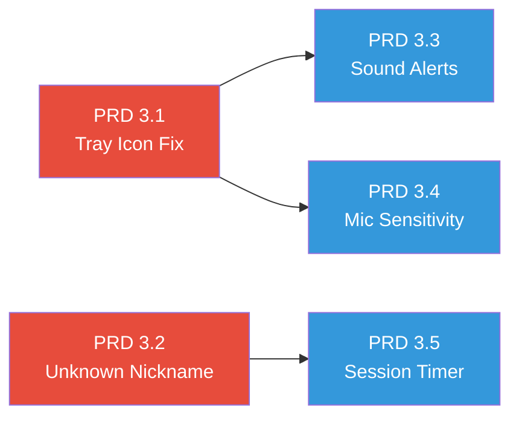

# Reson8 — Improvements PRD

**Created:** 21/03/2026
**Author:** Felipe B. Netto (assisted by AI)
**Status:** Draft — Pending Review

---

## Table of Contents

1. [PRD 3.1 — Tray Icon Not Visible in Production Build](#prd-31--tray-icon-not-visible-in-production-build)
2. [PRD 3.2 — Voice Call Disconnect & "Unknown" Nickname on Reconnect](#prd-32--voice-call-disconnect--unknown-nickname-on-reconnect)
3. [PRD 3.3 — Sound Alerts System](#prd-33--sound-alerts-system)
4. [PRD 3.4 — Mic Sensitivity Slider](#prd-34--mic-sensitivity-slider)
5. [PRD 3.5 — Voice Channel Session Timer](#prd-35--voice-channel-session-timer)

> [!IMPORTANT]
> Every implementation must be tracked and logged into `app-planning/progress.txt`
> following the established format, to maintain context for ongoing development.

---

## PRD 3.1 — Tray Icon Not Visible in Production Build

**Type:** 🐛 BUGFIX
**Priority:** High
**Affected Component:** Electron Main Process (`apps/client`)

### Problem Description

When running the client in development mode (`npm run dev:client` or
`npx electron .`), the system tray icon appears correctly. However, when
the app is built with `electron-builder` and launched as a packaged
application (AppImage, NSIS installer, etc.), the tray icon is invisible —
the tray entry exists (right-click works) but no icon is rendered.

### Root Cause Analysis

The tray icon is loaded in `main.ts` (line 234) using:

```typescript
const iconPath = path.join(__dirname, "..", "assets", "tray-icon.png");
```

In **development** mode, `__dirname` resolves to `apps/client/dist/`, so
`path.join(__dirname, "..", "assets", "tray-icon.png")` correctly resolves
to `apps/client/assets/tray-icon.png`.

In a **packaged** build, `__dirname` resolves to `app.asar/dist/` (inside
the ASAR archive). The `assets/` directory is **not included** in the
electron-builder `files` configuration in `package.json` (line 30–33):

```json
"files": [
    "dist/**/*",
    "node_modules/**/*",
    "!node_modules/.cache"
]
```

Only `dist/` and `node_modules/` are bundled into the ASAR. The `assets/`
directory is excluded entirely, so `nativeImage.createFromPath()` receives
a non-existent path and creates an empty/transparent image — resulting in
an invisible tray icon.

### Proposed Fix

**Approach A (Recommended): Include `assets/` in the electron-builder
`files` array.**

Modify `apps/client/package.json` → `build.files`:

```json
"files": [
    "dist/**/*",
    "assets/**/*",
    "node_modules/**/*",
    "!node_modules/.cache"
]
```

This ensures all asset files (tray icon, sound alerts, and any future
assets) are bundled inside the ASAR archive. The existing path reference
`path.join(__dirname, "..", "assets", "tray-icon.png")` will then resolve
correctly in both dev and packaged builds.

> [!NOTE]
> This same `files` change is a **prerequisite** for PRD 3.3 (Sound
> Alerts), since the sound alert mp3 files also live in `assets/`.

**Approach B (Alternative): Use `extraResources` to copy assets outside
the ASAR.**

```json
"extraResources": [
    { "from": "assets", "to": "assets" }
]
```

Then update the path in `main.ts`:

```typescript
const iconPath = app.isPackaged
    ? path.join(process.resourcesPath, "assets", "tray-icon.png")
    : path.join(__dirname, "..", "assets", "tray-icon.png");
```

Approach B is more complex and only justified if the files need to be
user-editable after installation. Since our assets are read-only, Approach
A is simpler and preferred.

### Files to Modify

| File | Change |
|:---|:---|
| `apps/client/package.json` | Add `"assets/**/*"` to `build.files` array |

### Verification

1. Build the client: `cd apps/client && npm run build:linux` (or `:win`).
2. Launch the packaged app.
3. Verify the system tray icon is visible and rendered correctly.
4. Right-click the tray icon — Restore/Quit menu should appear.
5. Dev mode should remain unaffected: `npm run dev` still shows the icon.

---

## PRD 3.2 — Voice Call Disconnect & "Unknown" Nickname on Reconnect

**Type:** 🐛 BUGFIX
**Priority:** Medium
**Affected Components:** Server (`connection.handler.ts`,
`presence.service.ts`), Client (reconnection flow)

### Problem Description

During a stable voice call with three participants on a channel, all users
were randomly disconnected. Upon reconnecting, one user's nickname
displayed as "Unknown" despite having correctly filled the nickname input
with "barrellaf".

### Server Log Analysis (`reson8-log.txt`)

**The Disconnection Event (04:32:17):**
```
[04:32:17.245] INFO: Client disconnected  socketId: "9vipkZp..."  nickname: "barrellaf"  reason: "transport close"
[04:32:17.248] INFO: Client disconnected  socketId: "bDztQxC..."  nickname: "dng"         reason: "transport close"
[04:32:17.248] INFO: Client disconnected  socketId: "JVTsksJ..."  nickname: "Kdshy"       reason: "transport error"
```

All three users were disconnected within 3 milliseconds, with reasons
"transport close" and "transport error". This is characteristic of a
**network-level interruption** (e.g., server-side socket timeout, WiFi
drop, or router NAT table flush), not an application bug. The server
correctly detected all three disconnections and cleaned up their sessions.

**The Reconnection (04:32:34–04:32:37):**

All three clients reconnected within seconds. The USER_JOIN_SERVER events
show correct nicknames and instance IDs. However, one user ("Kdshy",
instanceId `90bbd57f...`) triggered USER_JOIN_SERVER **three times**
(lines 31, 36, 59), suggesting rapid reconnection attempts — likely the
client auto-reconnecting while the user also manually triggered connect.

Additionally, several "Permission denied" warnings appeared for
`requiredPermission: "32"` (GET_BANNED_USERS — admin-only), confirming
the non-admin users' socket connections were established before their
server join was completely acknowledged.

**The "Unknown" Nickname Issue (05:19:52):**

A second disconnection hit at 05:19:52. "barrellaf" (instanceId
`89e20269...`) was disconnected with reason "ping timeout" — a Socket.io
heartbeat failure, again suggesting a network connectivity issue. The
user reconnected 6 seconds later:

```
[05:19:58.477] INFO: Client connected     socketId: "V6VyAbciUON5xpPFAAAx"
[05:19:59.247] INFO: User joined server   nickname: "barrellaf"
```

The nickname was correctly sent and logged server-side. The "Unknown"
display is caused by a **race condition in the `hydrateOccupants()`
function** in `connection.handler.ts` (line 161–186):

```typescript
node.occupants = await Promise.all(
    occupantIds.map(async (uid) => {
        const p = await presence.getUserPresence(uid);
        return {
            userId: uid,
            nickname: p?.nickname ?? "Unknown",  // ← fallback when Redis miss
            ...
        };
    }),
);
```

When the disconnecting user's old socket triggers a `disconnect` event,
`presence.leaveServer()` removes their Redis presence entry. If a
reconnecting client queries `getChannelOccupants()` during the brief
window between the reconnection completing and the new presence entry
being fully written, `getUserPresence()` returns `null`, and the fallback
`"Unknown"` nickname is used.

This same pattern appears in:
- `USER_JOIN_CHANNEL` handler (line 249, 277)
- `USER_LEAVE_CHANNEL` handler (line 354)
- `disconnect` handler (line 398)

### Proposed Fix

**1. Fallback to Database Nickname**

When `presence.getUserPresence()` returns `null`, query the User table
from Prisma as a fallback before defaulting to "Unknown":

```typescript
async function resolveNickname(uid: string): Promise<string> {
    // Try Redis presence first (fast path)
    const p = await presence.getUserPresence(uid);
    if (p?.nickname) return p.nickname;

    // Fallback to database (reliable but slower)
    const user = await app.prisma.user.findUnique({
        where: { id: uid },
        select: { nickname: true },
    });
    return user?.nickname ?? "Unknown";
}
```

Apply this `resolveNickname()` helper across all `hydrateOccupants()`,
`PRESENCE_UPDATE`, and `disconnect` cleanup paths where `"Unknown"` is
currently the fallback.

**2. Reconnection Resilience — Socket.io Auto-Reconnect Guard**

The triple USER_JOIN_SERVER from "Kdshy" suggests the client's Socket.io
instance may auto-reconnect (Socket.io's default behavior) while the user
also manually clicks Connect. The preload/renderer should guard against
emitting USER_JOIN_SERVER more than once per logical connection:

- Add a `joinServerInFlight` boolean guard in `preload.ts` (similar to
  the existing `isJoiningChannel` in `renderer.ts`)
- Prevent concurrent USER_JOIN_SERVER emissions
- Clear the guard on disconnect or error

**3. Stale Presence Cleanup (Defense-in-Depth)**

Add a TTL (time-to-live) to Redis presence entries. When a user joins a
server, set the presence key with a 5-minute TTL and refresh it on each
heartbeat/activity. This prevents permanently orphaned presence entries
from stale connections that didn't fire a clean `disconnect` event.

### Files to Modify

| File | Change |
|:---|:---|
| `apps/server/src/handlers/connection.handler.ts` | Add `resolveNickname()` helper; replace all `p?.nickname ?? "Unknown"` fallbacks |
| `apps/client/src/preload.ts` | Add `joinServerInFlight` guard to prevent duplicate USER_JOIN_SERVER |
| `apps/server/src/services/presence.service.ts` | (Optional) Add TTL to presence entries with periodic refresh |

### Verification

1. Run the server and connect two clients.
2. Join a voice channel with both.
3. Kill the server's network temporarily (or stop/restart the server
   container) to force a "transport close" disconnection.
4. Reconnect both clients and verify nicknames display correctly (no
   "Unknown" in the channel tree or presence updates).
5. Manual rapidly click Connect while Socket.io auto-reconnect is active
   — verify only one USER_JOIN_SERVER event is logged per client.

---

## PRD 3.3 — Sound Alerts System

**Type:** ✨ FEATURE
**Priority:** High
**Affected Components:** Client (`renderer.ts`, `preload.ts`, `main.ts`,
`index.html`)

### Overview

Implement audible notifications for key application events to improve the
user experience. All 16 sound alert mp3 files are already present in
`apps/client/assets/sound-alerts/` and each maps to a specific event
trigger.

### Sound Alert Mapping

| Sound File | Trigger Event | Category |
|:---|:---|:---|
| `connected.mp3` | Successfully connected to a server | Connection |
| `disconnected.mp3` | Disconnected from a channel (button or connection loss) | Connection |
| `channel_created.mp3` | Admin creates a new channel successfully | Admin Action |
| `channel_deleted.mp3` | Admin deletes a channel successfully | Admin Action |
| `user_joined_channel.mp3` | Another user joins your voice channel | Voice Channel |
| `user_disconnected_from_channel.mp3` | Another user leaves your voice channel | Voice Channel |
| `user_kicked_from_channel.mp3` | Admin kicks a user from your voice channel | Moderation |
| `you_were_kicked_from_channel.mp3` | You were kicked from a voice channel | Moderation |
| `user_banned_from_server.mp3` | Admin bans a user from the server | Moderation |
| `user_unbanned_from_server.mp3` | Admin unbans a user from the server | Moderation |
| `mic_muted.mp3` | Mic muted while in a voice channel | Voice Controls |
| `mic_activated.mp3` | Mic unmuted while in a voice channel | Voice Controls |
| `sound_muted.mp3` | Deafen activated while in a voice channel | Voice Controls |
| `sound_resumed.mp3` | Deafen deactivated while in a voice channel | Voice Controls |
| `hey_wake_up.mp3` | New unread DM received while DM tab is closed or app is minimized | DM Notification |
| `insufficient_perms.mp3` | Non-admin user attempts an admin-only action | Permissions |

### Implementation Details

#### 1. Sound Service Module (`apps/client/src/renderer/renderer.ts`)

Create a `SoundAlert` utility at the top of the renderer that preloads
Audio elements for all 16 sounds:

```typescript
const SoundAlert = {
    _cache: new Map<string, HTMLAudioElement>(),

    _getAudio(filename: string): HTMLAudioElement {
        if (!this._cache.has(filename)) {
            const audio = document.createElement("audio");
            audio.src = `../assets/sound-alerts/${filename}`;
            audio.preload = "auto";
            this._cache.set(filename, audio);
        }
        return this._cache.get(filename)!;
    },

    play(filename: string): void {
        const audio = this._getAudio(filename);
        audio.currentTime = 0;
        audio.play().catch(() => {}); // Ignore autoplay restrictions
    },
};
```

> [!NOTE]
> In Electron's renderer context, `audio.src` is resolved relative to
> the HTML file location (`dist/renderer/index.html`). The path
> `../assets/sound-alerts/...` traverses up from `dist/renderer/` to
> `dist/`, then into `assets/`. This works because PRD 3.1 ensures
> `assets/` is included in the build.

#### 2. Integration Points

Each trigger maps to a specific code location in `renderer.ts`:

**Connection Events:**
- `connected.mp3` → Inside the `server-connected` event handler, after
  `isConnected = true` and UI setup
- `disconnected.mp3` → Inside the `server-disconnected` event handler
  and inside `btnLeaveVoice.click` handler

**Channel Management (Admin):**
- `channel_created.mp3` → Inside `btnModalCreate.click` handler, after
  successful channel creation (`result.success === true`)
- `channel_deleted.mp3` → Inside `btnDeleteConfirm.click` handler, after
  successful channel deletion

**Voice Channel Presence:**
- `user_joined_channel.mp3` → Inside the `presence-update` event handler,
  when a new user appears in the current voice channel's occupant list
  that wasn't there before (compare previous occupants vs new occupants)
- `user_disconnected_from_channel.mp3` → Inside the `presence-update`
  event handler, when a user disappears from the current voice channel's
  occupant list

**Moderation:**
- `user_kicked_from_channel.mp3` → After successful `kickUser()` call
  (inside the kick button click handler)
- `you_were_kicked_from_channel.mp3` → Inside the `user-kicked` event listener
- `user_banned_from_server.mp3` → After successful `banUser()` call
- `user_unbanned_from_server.mp3` → After successful `unbanUser()` call

**Voice Controls:**
- `mic_muted.mp3` → Inside `btnMute.click` handler when result is muted AND user is in voice
- `mic_activated.mp3` → Inside `btnMute.click` handler when result is unmuted AND user is in voice
- `sound_muted.mp3` → Inside `btnDeafen.click` handler when result is deafened AND user is in voice
- `sound_resumed.mp3` → Inside `btnDeafen.click` handler when result is undeafened AND user is in voice

**DM Notification:**
- `hey_wake_up.mp3` → Inside the `dm-received` event listener, ONLY when:
  1. The DM tab for that sender is NOT currently active (i.e.,
     `activeTabId !== "dm:{senderId}"`), AND
  2. The app window is minimized or unfocused (use an IPC call to check
     `mainWindow.isFocused()` and `mainWindow.isMinimized()`)

**Permission Denied:**
- `insufficient_perms.mp3` → When `createChannel`, `deleteChannel`,
  `kickUser`, `banUser`, or `unbanUser` return `{ success: false }` with
  a permission-related error

#### 3. Volume Control (Optional Future Enhancement)

Consider adding a master volume slider in Settings → Application tab in
a future iteration. For now, all alerts play at full volume.

#### 4. Asset Path for Packaged Builds

Since PRD 3.1 adds `"assets/**/*"` to `build.files`, the sound alert
mp3 files will be bundled inside the ASAR archive. The relative path
`../assets/sound-alerts/filename.mp3` from the renderer HTML file will
resolve correctly in both dev and packaged builds.

### Files to Modify

| File | Change |
|:---|:---|
| `apps/client/package.json` | Ensure `"assets/**/*"` is in `build.files` (from PRD 3.1) |
| `apps/client/src/renderer/renderer.ts` | Add `SoundAlert` utility, integrate `SoundAlert.play()` calls at all trigger points |
| `apps/client/src/preload.ts` | Add `isWindowFocused()` IPC bridge method for DM notification check |
| `apps/client/src/main.ts` | Add `ipcMain.handle("is-window-focused", ...)` handler |

### Verification

1. Connect to a server → hear `connected.mp3`.
2. Join a voice channel → no sound (sounds are for others joining).
3. Have another client join the same channel → hear `user_joined_channel.mp3`.
4. Click Mute → hear `mic_muted.mp3`. Click again → hear `mic_activated.mp3`.
5. Click Deafen → hear `sound_muted.mp3`. Click again → hear `sound_resumed.mp3`.
6. Leave voice → hear `disconnected.mp3`.
7. Create a channel (admin) → hear `channel_created.mp3`.
8. Delete a channel (admin) → hear `channel_deleted.mp3`.
9. Try to create a channel as non-admin → hear `insufficient_perms.mp3`.
10. Kick a user from channel (admin) → hear `user_kicked_from_channel.mp3`.
    The kicked user → hears `you_were_kicked_from_channel.mp3`.
11. Ban a user (admin) → hear `user_banned_from_server.mp3`.
12. Unban a user (admin) → hear `user_unbanned_from_server.mp3`.
13. Send a DM to a user whose DM tab is closed → recipient hears `hey_wake_up.mp3`.
14. Verify alerts DO NOT play when the DM tab for that sender is already focused.
15. Build the app and verify all sounds work in the packaged build.

---

## PRD 3.4 — Mic Sensitivity Slider

**Type:** ✨ FEATURE
**Priority:** Medium
**Affected Components:** Client (`renderer.ts`, `voice.service.ts`,
`preload.ts`, `index.html`)

### Overview

Add a microphone activation threshold slider to the "Voice & Shortcuts"
settings tab. When enabled, the user's microphone only transmits audio
when the input level exceeds a configurable dB threshold. This serves as
a client-side noise gate, reducing background noise during voice calls.

### Behavior

- **Toggle:** A toggle switch enables/disables the mic sensitivity feature.
  When disabled, the mic behaves as it does today (always transmitting
  when unmuted). When enabled, the slider becomes visible and active.
- **Slider:** A range input (`<input type="range">`) from -60 dB to 0 dB,
  defaulting to -40 dB. Lower values = more sensitive (picks up quieter
  sounds). Higher values = less sensitive (requires louder input).
- **Real-time visual feedback:** A small meter next to the slider shows
  the current mic input level, helping users calibrate the threshold.
- **Persistence:** The toggle state and slider value are saved to
  `localStorage`:
  - `reson8-mic-sensitivity-enabled` — `"true"` or absent
  - `reson8-mic-sensitivity-threshold` — numeric dB value as string

### Technical Implementation

#### 1. Audio Analysis (Client-Side)

Use the Web Audio API's `AnalyserNode` to measure real-time mic input
levels:

```typescript
// In voice.service.ts
private analyser: AnalyserNode | null = null;
private silenceCheckInterval: number | null = null;
private sensitivityThreshold: number = -40; // dB
private sensitivityEnabled: boolean = false;

enableSensitivity(threshold: number): void {
    this.sensitivityEnabled = true;
    this.sensitivityThreshold = threshold;
    this.startSilenceDetection();
}

disableSensitivity(): void {
    this.sensitivityEnabled = false;
    this.stopSilenceDetection();
    // Resume producer if it was paused
    if (this.producer && this.producer.paused) {
        this.producer.resume();
    }
}

private startSilenceDetection(): void {
    if (!this.localStream) return;

    const audioCtx = new AudioContext();
    const source = audioCtx.createMediaStreamSource(this.localStream);
    this.analyser = audioCtx.createAnalyser();
    this.analyser.fftSize = 2048;
    source.connect(this.analyser);

    const dataArray = new Float32Array(this.analyser.fftSize);

    this.silenceCheckInterval = window.setInterval(() => {
        if (!this.analyser || !this.producer) return;

        this.analyser.getFloatTimeDomainData(dataArray);

        // Calculate RMS (Root Mean Square) → dB
        let sum = 0;
        for (let i = 0; i < dataArray.length; i++) {
            sum += dataArray[i] * dataArray[i];
        }
        const rms = Math.sqrt(sum / dataArray.length);
        const db = 20 * Math.log10(rms + 1e-10); // Avoid log(0)

        if (db > this.sensitivityThreshold) {
            if (this.producer.paused) this.producer.resume();
        } else {
            if (!this.producer.paused) this.producer.pause();
        }
    }, 50); // Check every 50ms (20Hz)
}
```

#### 2. UI (Settings → Voice & Shortcuts)

Add a new section between the "Voice Input Mode" toggle and the
"Keyboard Shortcuts" label:

```html
<!-- Mic Sensitivity Section -->
<label style="margin-bottom:4px; display:block;">Mic Sensitivity</label>

<div class="toggle-row" id="mic-sensitivity-row">
  <div class="toggle-row-info">
    <div class="toggle-row-icon">
      <svg width="14" height="14" viewBox="0 0 24 24" fill="none"
           stroke="currentColor" stroke-width="2" stroke-linecap="round"
           stroke-linejoin="round">
        <path d="M12 1a3 3 0 0 0-3 3v8a3 3 0 0 0 6 0V4a3 3 0 0 0-3-3z"/>
        <path d="M19 10v2a7 7 0 0 1-14 0v-2"/>
        <line x1="12" y1="19" x2="12" y2="23"/>
        <line x1="8" y1="23" x2="16" y2="23"/>
      </svg>
    </div>
    <div class="toggle-row-text">
      <span class="toggle-row-title">Noise Gate</span>
      <span class="toggle-row-desc">Only transmit audio above a dB threshold</span>
    </div>
  </div>
  <label class="toggle-switch">
    <input type="checkbox" id="chk-mic-sensitivity">
    <span class="toggle-slider"></span>
  </label>
</div>

<!-- Slider (hidden when toggle is off) -->
<div id="mic-sensitivity-slider-wrap" style="display:none; margin-bottom:14px;">
  <div style="display:flex; align-items:center; gap:10px;">
    <span style="font-size:10px; color:var(--text-muted); width:30px;">-60dB</span>
    <input type="range" id="mic-sensitivity-slider" min="-60" max="0"
           value="-40" step="1" style="flex:1; accent-color:var(--accent);">
    <span style="font-size:10px; color:var(--text-muted); width:24px;">0dB</span>
  </div>
  <div style="display:flex; justify-content:space-between; margin-top:4px;">
    <span style="font-size:10px; color:var(--text-muted);">More sensitive</span>
    <span id="mic-sensitivity-value" style="font-size:10px; color:var(--accent); font-weight:600;">-40 dB</span>
    <span style="font-size:10px; color:var(--text-muted);">Less sensitive</span>
  </div>
  <!-- Live level meter -->
  <div id="mic-level-meter" style="height:4px; background:var(--border); border-radius:2px; margin-top:8px; overflow:hidden;">
    <div id="mic-level-bar" style="height:100%; width:0%; background:var(--accent); transition:width 0.05s; border-radius:2px;"></div>
  </div>
</div>
```

#### 3. Renderer Logic

- When the toggle is enabled, show the slider and start a mic level
  visualization loop (using the same AnalyserNode data fed to the meter).
- When the slider value changes, call
  `api.setMicSensitivity(thresholdDb)` and update localStorage.
- On page load, restore saved values and sync with VoiceService.
- The meter (`#mic-level-bar`) animates in real-time when the slider
  section is visible, allowing users to see their current mic level and
  adjust the threshold accordingly.

#### 4. Preload Bridge

```typescript
setMicSensitivity(enabled: boolean, threshold: number): void
getMicLevel(): number // Returns current dB for meter animation
```

### Files to Modify

| File | Change |
|:---|:---|
| `apps/client/src/renderer/index.html` | Add Mic Sensitivity toggle, slider, level meter UI to Voice & Shortcuts tab |
| `apps/client/src/renderer/renderer.ts` | Add sensitivity state, toggle/slider handlers, meter animation loop, localStorage persistence |
| `apps/client/src/services/voice.service.ts` | Add `AnalyserNode`-based silence detection, `enableSensitivity()` / `disableSensitivity()` / `setThreshold()` methods |
| `apps/client/src/preload.ts` | Expose `setMicSensitivity()` and `getMicLevel()` on `reson8Api` |

### Persistence (localStorage Keys)

| Key | Value |
|:---|:---|
| `reson8-mic-sensitivity-enabled` | `"true"` or absent |
| `reson8-mic-sensitivity-threshold` | Numeric dB string (e.g., `"-40"`) |

### Verification

1. Open Settings → Voice & Shortcuts.
2. Toggle "Noise Gate" ON → slider and meter should appear.
3. Speak into the mic → meter should react to voice volume.
4. Set threshold to -20 dB → only loud sounds should activate the mic.
5. Set threshold to -50 dB → almost all sounds should pass through.
6. Toggle OFF → mic should transmit normally (no noise gate).
7. Close and reopen Settings → saved values should persist.
8. Join a voice call with two clients and verify that background noise
   below the threshold is not transmitted to the other client.

---

## PRD 3.5 — Voice Channel Session Timer

**Type:** ✨ FEATURE
**Priority:** Low
**Affected Components:** Server (`connection.handler.ts`, `voice.handler.ts`,
shared-types), Client (`renderer.ts`, `index.html`)

### Overview

When at least one user is connected to a voice channel, a "session"
starts. A timer displays the elapsed session duration below the channel
name in the channel tree. When the last user disconnects and the channel
becomes empty, the session resets. When a new user joins the empty
channel, a new session begins.

> [!NOTE]
> Only **voice channels** have this feature. Text channels do not share
> the concept of "sessions".

### Session Lifecycle

```
Channel Empty    →  User joins    →  Session starts (startedAt = now)
Session Active   →  More users    →  Timer keeps running (same session)
Session Active   →  All users     →  Session ends, timer resets
                    leave
Channel Empty    →  User joins    →  New session starts (new startedAt)
```

### Implementation Details

#### 1. Server-Side Session Tracking

The server is the source of truth for session start time. This ensures
all clients display synchronized timers regardless of when they connect.

**In `connection.handler.ts` / `voice.handler.ts`:**

- Maintain a server-side `Map<string, Date>` mapping
  `channelId → sessionStartedAt`.
- When a user joins a voice channel (via `USER_JOIN_CHANNEL`) and the
  channel was previously empty (occupant count goes from 0 → 1), record
  `sessionStartedAt = new Date()`.
- When a user leaves a voice channel (via `USER_LEAVE_CHANNEL` or
  `disconnect`) and the channel becomes empty (occupant count goes to 0),
  delete the `sessionStartedAt` entry.
- Include `sessionStartedAt` in `PRESENCE_UPDATE` events for voice
  channels so all clients can compute the elapsed time locally.

**Shared Types:**

Add `sessionStartedAt?: string` (ISO 8601) to the `PRESENCE_UPDATE`
payload in `socket-events.ts`.

#### 2. Client-Side Timer Display

**In `renderer.ts`:**

- Maintain a `Map<string, string>` mapping
  `channelId → sessionStartedAt` ISO string.
- On receiving `PRESENCE_UPDATE` with `sessionStartedAt`, store the value.
- When `sessionStartedAt` is null/undefined or occupants is empty, remove
  the entry (session ended).
- A `setInterval` (every 1 second) updates the timer display for the
  currently visible voice channels in the channel tree.

**Timer Format:**
- Under 1 hour: `MM:SS` (e.g., `04:32`)
- Over 1 hour: `H:MM:SS` (e.g., `1:23:45`)

**In `index.html`:**

Add a `<span class="session-timer">` element rendered by
`renderChannel()` below the channel name, with smaller font size
(approximately half the channel name font size, ~9px), muted color.

```css
.session-timer {
    font-size: 9px;
    color: var(--text-muted);
    margin-left: 4px;
    font-variant-numeric: tabular-nums; /* prevents layout shift */
    opacity: 0.7;
}
```

#### 3. Channel Tree Rendering

Modify `renderChannel()` to append the timer span after the channel name
when a session is active:

```typescript
// Inside renderChannel() for voice channels
if (sessionTimers.has(node.id)) {
    const timerSpan = document.createElement("span");
    timerSpan.className = "session-timer";
    timerSpan.setAttribute("data-session-channel", node.id);
    channel.appendChild(timerSpan);
}
```

The global 1-second interval updates all visible timer spans:

```typescript
setInterval(() => {
    for (const [channelId, startedAt] of sessionTimers) {
        const el = document.querySelector(
            `[data-session-channel="${channelId}"]`
        ) as HTMLSpanElement | null;
        if (el) {
            el.textContent = formatDuration(
                Date.now() - new Date(startedAt).getTime()
            );
        }
    }
}, 1000);
```

#### 4. Voice Panel Timer (Below Channel Name)

The session timer should also appear in the voice panel (`#voice-panel`)
beneath the voice channel name (`#voice-channel-name`). This is the most
prominent display of the timer when a user is actively connected.

Add a `<span id="voice-session-timer">` element right after the
`#voice-channel-name` span in the voice panel:

```html
<div class="voice-info">
    <span class="dot"></span>
    <div style="display:flex; flex-direction:column;">
        <span id="voice-channel-name">Voice Connected</span>
        <span id="voice-session-timer" class="session-timer"></span>
    </div>
</div>
```

The timer update loop should also update this element when the user is
in a voice channel.

### Files to Modify

| File | Change |
|:---|:---|
| `packages/shared-types/src/socket-events.ts` | Add `sessionStartedAt?: string` to `PRESENCE_UPDATE` payload |
| `apps/server/src/handlers/connection.handler.ts` | Add session start/end tracking, include `sessionStartedAt` in `PRESENCE_UPDATE` |
| `apps/client/src/renderer/renderer.ts` | Add `sessionTimers` map, `formatDuration()`, timer update interval, modify `renderChannel()` and `updateVoiceUI()` |
| `apps/client/src/renderer/index.html` | Add `.session-timer` CSS, `#voice-session-timer` element in voice panel |

### Verification

1. Join an empty voice channel → timer should start at `00:00` and count up.
2. Have a second client join → timer continues (does not reset).
3. First client leaves → timer continues (channel still has occupants).
4. Second client leaves (channel empty) → timer resets/disappears.
5. A new client joins → timer restarts at `00:00`.
6. Wait over 1 hour → format should switch to `H:MM:SS`.
7. Verify the timer appears:
   - In the channel tree next to the voice channel name
   - In the voice panel beneath the "Voice: ChannelName" label
8. Disconnect from the server → timer should clear.
9. Reconnect → existing active sessions should show the correct elapsed
   time (synced from server's `sessionStartedAt`).

---

## Summary of Cross-Cutting Dependencies



- **PRD 3.1** (Tray Icon) is a **prerequisite** for PRD 3.3 (Sound
  Alerts) — both need `assets/` in the build.
- **PRD 3.2** (Unknown Nickname) and **PRD 3.5** (Session Timer) both
  touch `connection.handler.ts` and the `PRESENCE_UPDATE` event, so they
  share implementation overlap.
- **PRD 3.4** (Mic Sensitivity) is fully independent and can be
  implemented in any order.

### Recommended Implementation Order

1. **PRD 3.1** — Tray Icon Fix (5 min, unblocks 3.3)
2. **PRD 3.2** — Unknown Nickname Fix (30 min)
3. **PRD 3.3** — Sound Alerts (1–2 hours)
4. **PRD 3.4** — Mic Sensitivity Slider (1–2 hours)
5. **PRD 3.5** — Session Timer (1 hour)

---

> **Progress Tracking Reminder:** After implementing each PRD item,
> add a new entry to `app-planning/progress.txt` following the
> established `--- Entry: DD/MM/YYYY ---` format, documenting:
> - Feature/Fix name
> - Problem description
> - Solution summary
> - Key files modified
> - Next step
